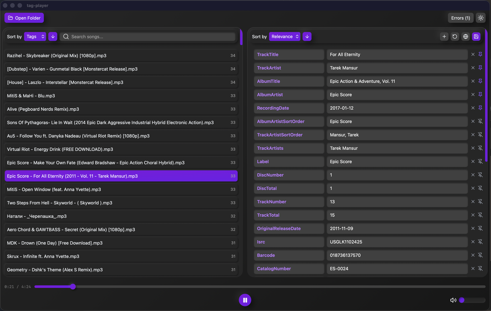

# TagPlayer

A desktop music player with tag viewing/editing capabilities built with Tauri and SvelteKit.



## Features
- Recursive music file discovery
- Native audio playback
- Search by title, artist, genre, and other tags
- Edit music tags

## Development

```bash
# Start development server with hot reload
npm run tauri dev

# Lint frontend
npm run check

# Backend commands (from src-tauri/)
cargo check    # Lint backend
cargo build    # Build debug binary
cargo test     # Run tests
```
